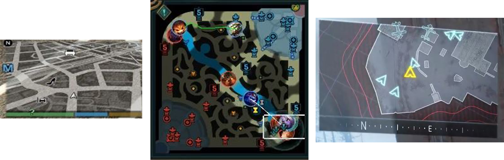
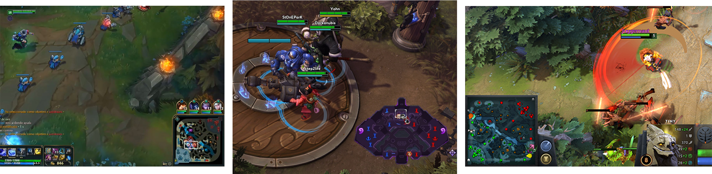
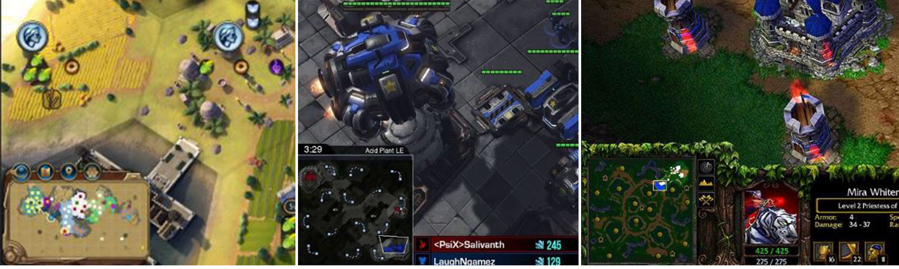
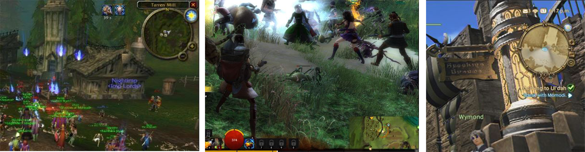
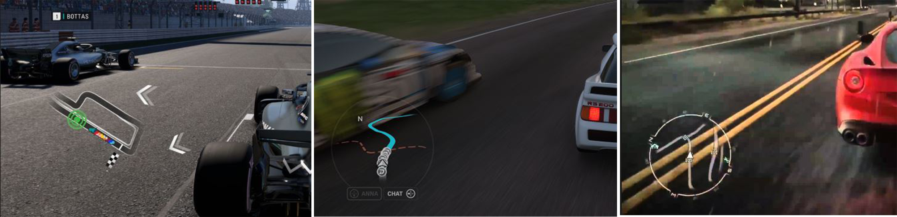
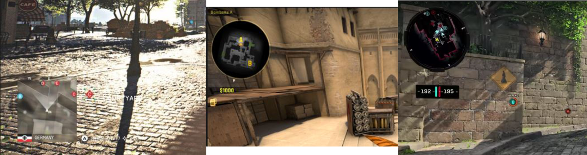
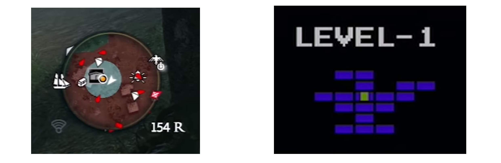
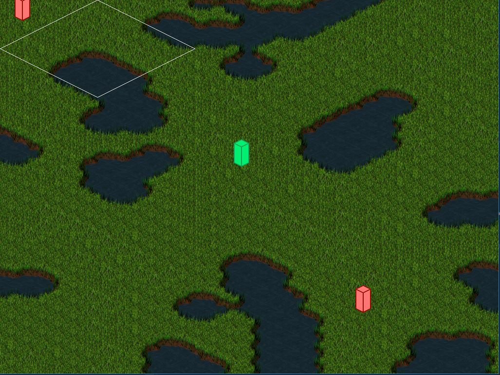
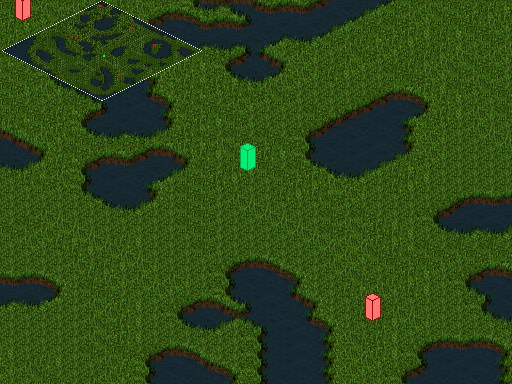
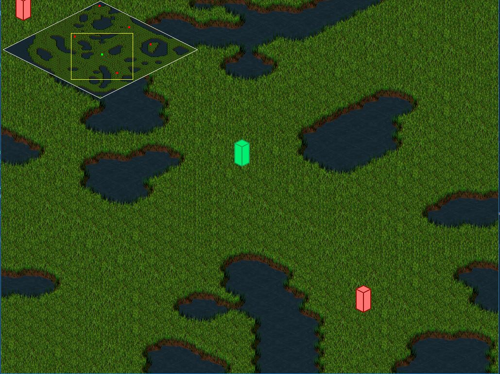

“I am [Òscar Faura](https://www.linkedin.com/in/ofaura21/ "LinkedIn"), student of the [Bachelor’s Degree in Video Games by UPC at CITM](https://www.citm.upc.edu/ing/estudis/graus-videojocs/ "Link to the Degree"). This content is generated for the second year’s subject Project 2, under supervision of lecturer [Ricard Pillosu](https://es.linkedin.com/in/ricardpillosu "LinkedIn").”

# What is a Minimap?
A minimap is an element of the HUD usually placed at a screen corner that represents a map, but its size is much smaller. The function of a minimap is to help the player get orineted.

The common elements usually included in minimaps are the position of the player, the allies and enemies, buildings, terrain, and points of interests. Elements that are not visible for the player, should not appear in the minimap.   




# Where should it be located?
Depending on the videogame genre, there are some conventions on where to locate the minimap. But there are always exceptions.


* **MOBA games** place the minimap at the bottom.



* **Strategy games** place the minimap at the bottom left.



* **MMORPG's** place the minimap at the right and mostly at the top.



* **Racing games** place the minimap at the left.



* **FPS** mainly place the minimap at the left.



# Old vs Modern Minimaps. Pros and Cons
The old minimaps where more effective, they show you where the player is so he can get to acknowledge of surrounding to get somewhere new. Minimaps like this are simple but they work, they do not tell you where do you have to go, so they do not make feel things linear and encourages the player to explore.
With modern games, the minimap shows where every enemy is and also provides the layout of an area without letting you explore it first. This removes the element of surprise when the enemies attack you and also a part of discovery. You can basically play the game looking to the minimap, and that is the major problem in games where exploration is rewarded or encouraged. The player spends a lot of the time looking to the minimap and not to the whole screen.
 


# Does my game need a Minimap?
It depends on the kind of game you are developing and the use you will give to the minimap. You have to take to account if the minimap conflicts with some of your game pillars, and if it does, evaluate how much does it affect and try to find possible solutions. For instance, if one of your games pillars is to fight all the enemies, do not put on the minimap the area where they are looking, because it gives the possibility to the player to avoid fighting. Only the necessary features should be included.
As a general rule, a minimap should be used:
* When the level or world is large.
* When there are multiple ways to reach the same destination.
* When there are lots of different points of interest.
* If you are doing an RTS, it is a must.

You can always give the possibility to the player to remove or not the minimap if it does not affect to the core of the game.


# Implementation
To create a minimap we will follow a series of TODO's to know the steps to make a basic minimap module. Our goal is to blit to a screen corner the minimap, which it will be the whole map and it will show the position of the player and the enemies, a rectangle of the part you are seeing, and the possibility to move the camera through the minimap.

This is our goal:


If you execute the game, you should see this untill TODO 4 included:



## TODO 1
```
 // TODO 1: Initialize the variable "map_width" to obtain the width of the map in pixels
 // Initialize the variable "minimap_scale" to get the relation between the map width and
 // the minimap width (defined at config.xml and initialized in Awake())
```
<details> 
  <summary>Solution (click to open)</summary>
  <p> 
     
  </p>
</details>


## TODO 2
```
 // TODO 2: Use the function SDL_CreateRGBSurface() to allocate a RGB surface to the variable "map_surface"
 // The last four parameters should be: 0x00ff0000, 0x0000ff00, 0x000000ff, 0xff000000 in order to be totally transparent
 // You have to add the x & y offsets
```
<details> 
  <summary>Solution (click to open)</summary>
  <p> 
     
  </p>
</details>


## TODO 3
```
 // TODO 3: Use the function SDL_CreateSoftwareRenderer() to create a 2D software rendering context for a surface
 // Assign it to the variable "map_renderer"
```
<details> 
  <summary>Solution (click to open)</summary>
  <p> 
     
  </p>
</details>


## TODO 4
```
 // TODO 4: Blit the minimap. You need to pass all the parameters until renderer included.
 // As it is an isometric map, keep in mind that x == 0 is in the middle of the map.
```
<details> 
  <summary>Solution (click to open)</summary>
  <p> 
     
  </p>
</details>


## TODO 5
```
 // TODO 5: Use the function SDL_CreateTextureFromSurface to create a texture from an existing surface
 // Assign it to the variable "map_tex". Use the renderer from render.h
```
<details> 
  <summary>Solution (click to open)</summary>
  <p> 
     
  </p>
</details>


After implementing TODO 5, you should see:
 


## TODO 6
```
 // TODO 6: Initialize the variables "pos_x" and "pos_y" to get the position of an entity IN the minimap
```
<details> 
  <summary>Solution (click to open)</summary>
  <p> 
     
  </p>
</details>


## TODO 7
```
 // TODO 7: Fill the missing parameters of DrawQuad() function.
 // Take into account that it is an isometric map
```
<details> 
  <summary>Solution (click to open)</summary>
  <p> 
     
  </p>
</details>


After implementing TODO 7, you should see:
 
 
 
## TODO 8
```
 // TODO 8: Fill the parameters of "map_camera"	to see in the minimap which part of the map are you seeing
 // Take into account that it is an isometric map
 // Reminder: The camera values are negative
```
<details> 
  <summary>Solution (click to open)</summary>
  <p> 
     
  </p>
</details>


After implementing TODO 5, you should see:
 
 

## TODO 9
```
 // TODO 9: Assign to "map_x" and "map_y" the mouse position respect the minimap, to the
 // position that corresponds to the map
 // Take into account that it is an isometric map
```
<details> 
  <summary>Solution (click to open)</summary>
  <p> 
     
  </p>
</details>


## TODO 10
```
 // TODO 10: Assign to the center of the camera, the coordinates "map_x" and "map_y"
```
<details> 
  <summary>Solution (click to open)</summary>
  <p> 
     
  </p>
</details>


# Webgraphy
[Mini-map](https://en.wikipedia.org/wiki/Mini-map)


[Mini map by Jack Davies](https://gameuipatterns.com/gameui/mini-map/)


[Where should we place the mini map? by Jacek Sliwinski](https://www.gamasutra.com/blogs/JacekSliwinski/20130121/185119/Where_should_we_place_the_mini_map.php)


[Death to the mini-map by Martin Robinson](https://www.eurogamer.net/articles/2014-11-01-its-time-to-tear-up-the-mini-map)


[Mini-Maps Are Stupid by Razbuten](https://www.youtube.com/watch?v=4FfG-4HKoWQ)
