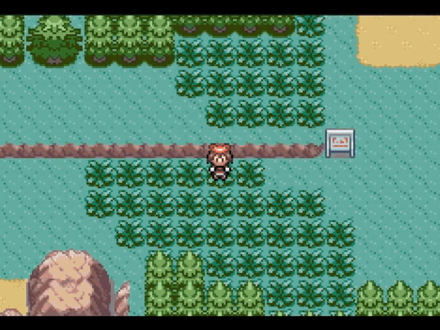
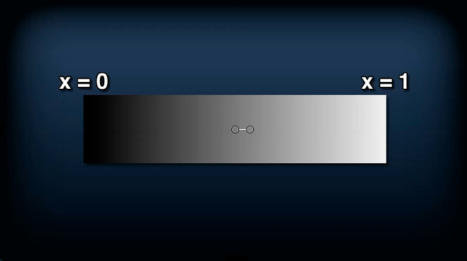

# Camera Transitions
This research project was developed by [Ángel González J.](https://www.linkedin.com/in/%C3%A1ngel-gonz%C3%A1lez-jim%C3%A9nez-147174196/?locale=es_ES "My LinkedIn") , a second year student of the [Bachelor's degree in Video Game Design and Development at CITM/TTC](<https://www.citm.upc.edu/ing/estudis/graus-videojocs/> "The Degree") as of 31/03/2020. 

The project has two main goals:
- To research about camera transitions and prepare a document and a presentation on the topic.
- To produce a functional scene and transition system in C++ and make some coding exercices about the system.

This content was generated for the Project II subject under the supervision of lecturer [Ramón Santamaria](<https://www.linkedin.com/in/raysan/> "His LinkedIn").

## Table of contents
- What is a camera transition?

- Basic Transitions

- Why Apply Camera Transitions to Video Games?

  - The reasoning behind video game camera transitions.
  
  - Other uses for video game transitions.
  
- Video Game Transition Techniques

  - Manipulating geometrical forms.
  
  - Manipulating the scene's texture.
  
  - Shaders.
  
- Video Game Transition Examples

  - Basic Transitions.
  
  - Advanced Transitions.
  
  - Themed Transitions.
  
- Code Implementation

  - System Implementation
    - Scene Manager
    - Scene
    - Transition Manager
    - Transition Class
    
  - Transition Structure
  
  - The math behind the transitions.
    - Cutoff and its relation with time.
    - Linear Interpolation
    - Non-Linear Interpolation
    
  - My Transitions
  
  - Code Exercises
  
  - Links and References

## What is a camera transition?
Camera transitions are a post-production technique used to connect one shot/scene to another. With their origins being in the film industry, they are used to convey a mood, suggest the passage of time… In short, for aesthetic reasons. Moreover, moving the camera through the scene can also be considered a camera transition. 

So far so good, right? Let's see some transition examples.

## Basic Camera Transitions
- **Disclaimer:** Sources can be found after the **Zoom** section.

### Cut
A Cut instantly connects one shot to another, and is normally used to change the perspective or to advance the story. There are many types of cuts: Cutting on action, Cut Away, Cross Cut, Jump Cut... and each of them serve a particular purpose. 

Its the transition that is the most commonly seen.

### Fade In/Out
In a Fade In, the scene gradually turns to one colour and in a Fade Out is the opposite happens. Although any colour can potentially be used in this transition, most of the times only two are used: black and white. Black conveys completion or the passage of a period of time. White, on the other hand, conveys ambiguity and hope. 

Its the most common transition after the Cut.

### Wipe
In a Wipe a shot replaces another, normally by traveling from one side of the frame to the other. They are often used to transition between storylines taking place in different locations and to establish tension or conflict. 

Wipes can come in many forms and shapes, as can be seen in the media below:

### Dissolve
In a Dissolve, one scene overlaps with another. The transitioning scene gradually loses opacity while the scene that's being transitioned to gradually gains it. Usually used at the end of one scene and the beginning of the next, it can show that there is a link between two narratives or scenes. This transition can also be implemented to show the passage of time or to move from one location to another.

Although it was common some decades ago, nowadays it's a pretty rare transition to see.

### Zoom
In a Zoom, the camera smoothly transitions from a long shot to a close-up and viceversa, normally by increasing or decreasing the camera's zoom. It is normally used to convey a frenetic pace, to quickly change shots or to emphasize someone or something that's on-screen.

Some zoom examples can be seen in the media below:

---
If you want to know more about these kind of transitions, consider taking a look at [Cuts & Transitions 101](https://www.youtube.com/watch?v=OAH0MoAv2CI "Cuts & Transitions 101"). It offers a more in-depth explanation on every transition that has been mentioned above and introduces some more.

---

## Why apply camera transitions to video games?
Now to the main question, why should anyone go throught the trouble of implementing camera transitions in their games? 

Before answering that question, let's closely observe the material below and see what happens.

### The reasoning behind video game camera transitions
To put it plainly, it's to hide different elements from the player's sight.

Contrary to films, video games require time to load from one scene to another.

To transition from one scene to another, the current scene, and it's related information, needs to be unloaded and the next one to be loaded. This process can freeze the game for a period of time, as it has just been seen in the piece of media seen above above. This "freeze time" can be from milliseconds to, at worst, minutes long. 

So, what would players think if the game just froze every time they triggered a scene change? If this process is not hidden from the players, they would have the impression that the game is bugged or that it was poorly developed.

So, summarizing, while traditionally camera transitions are used for aesthetic purposes, in video games they serve a far more utilitarian purpose.

### Other uses for video game transitions
Although originally camera transitions had to be implemented for purely utilitarian reasons (due to technological limitations), nowadays, technology has advanced enough to allow video games to afford using them for non-utilitarian purposes such as to enhance the players' immersion or to spice up the narrative, among others. 

One great example of how to use camera transitions to heighten both the narrative and it's emotional impact on the players is ***Vagrant Story (PSX)***. See how the camera is translated and, taking advantage of the time that the camera is covered by the main character, the game loads the model of the other character, creating a "reveal" moment when there was none previously.

**Source:** *Vagrant Story* (PSX)

Now, notice how cleverly an effect as simple as a Cut To Black can be used, again, to enhance the narrative. It should be noted that this segment of the game belongs to the introduction, not the end of the game.

**Source:** *Vagrant Story* (PSX)

## Camera Transition Techniques
### Manipulating a geometrical form
This technique consists "just" in manipulating the properties of geometrical shapes (often black rectangles) and usually the main properties that are manipulated are the shape's position and opacity.

Although it is quite a simple technique to implement code wise (in comparison to the following two), that simplicity really limits the possibilites that it can offer.

")

**Source:** *Pokemon Fire Red / Green Leaf* (GBA)

### Manipulating the scene's texture
All the textures are blended together and re-rendered into a new texture, which is then manipulated. 

Although it is quite complex to implement this technique code wise, it's a really flexible way of making transitions as textures can be modified and tampered with in a great deal of ways. 

For reference take a look at the piece of media shown below:

**Source:** *Xenosaga Episode I* (PS2)

### Shaders
Shaders are chunks of code that are executed in the GPU, and they modify the way an image is rendered.

Code wise, this technique entails an even higher level of complexity than manipulating a texture. However, using shaders to make transitions has become a widespread practice due to the sheer amount of possibilities that they bring.

#### Shader Transition Examples
- **Disclaimer:** Both shader transitions shown below were made in [Unity](https://unity.com/ "Unity Engine").
- **Disclaimer II:** Sources can be found after the **Pokeball Transition** section.

**Waves Transition**
Original Texture:

Transition:

**Pokeball Transition**

Original Texture:

Transition:

---
If you want to know more about applying shaders to camera transitions, consider checking [Shaders Case Study - Pokémon Battle Transitions](<https://www.youtube.com/watch?v=LnAoD7hgDxw> "Shaders Case Study - Pokémon Battle Transitions") out, it is really easy to understand and does a great job at introducing the basics.

---

## VG Transition Examples
#### Disclaimer 
The majority of the transitions that will be set as examples come from JRPG games, in special from battle transitions. This is due to the fact that battle transitions are as diverse as they can be, and this particular segment of camera transitions reach out to all camera transition techniques to bring to reality really interesting transitions.

### Basic transitions
#### Fade To Black

")

**Source:** *Pokemon Fire Red / Green Leaf* (GBA)

#### Fancy Fade To Black (South Park: The Stick of Truth (PC/PS4/XBOX ONE/Nintendo Switch))

")

**Source:** *South Park: The Stick of Truth* (PC/PS3&4/XBOX360&ONE/Nintendo Switch)

#### Wipe (Pokemon Red/Blue (GBC))

")

**Source:** *Pokemon Red/Blue* (GBC)

#### Horizontal Alternating Bars (Pokemon Red/Blue (GBC))

")

**Source:** *Pokemon Red/Blue* (GBC)

#### Vertical Alternating Bars (Pokemon Red/Blue (GBC))

")

**Source:** *Pokemon Red/Blue* (GBC)

#### Camera Translation (Vagrant Story)

")

**Source:** *Vagrant Story* (PSX)

#### Composition of Basics (Grandia II)

")

**Source:** *Grandia II* (PS2)

### Advanced Transitions
#### Sliding Quarters (Pokemon Red/Blue GBC)

")

**Source:** *Pokemon Red/Blue* (GBC)

#### Texture Re-Scaling (Pokemon Red/Blue GBC)

")

**Source:** *Pokemon Red/Blue* (GBC)

#### Texture Manipulation: Flakes / Scales (Wild Arms 5)

")

**Source:** *Wild Arms 5* (PS2)

#### Texture Manipulation: Blender Effect (Xenosaga Episode I)

")

**Source:** *Xenosaga Episode I* (PS2)

#### Composition of Advanced (Chrono Cross)

")

**Source:** *Chrono Cross* (PSX) 

### Themed Transitions
#### Pokemon: Battle against a Gym Leader Brock (Pokemon Fire Red / Green Leaf GBA)

")

**Source:** *Pokemon Fire Red / Green Leaf* (GBA)

#### Pokemon: Battle against Zygarde (Pokemon X / Y)

")

**Source:** *Pokemon X / Y* (3DS)

#### Resident Evil: Door Transition (Resident Evil PSX)

**Source:** *Resident Evil* (PSX)

#### Multiple Games: Mirror Break Effect (Shadow Heartsfrom the New World, Resonande of Fate, Fate/Extra, Tales of Symphonia, Dawn of the New World, Xenoblade Chronicles 2, Final Fantasy X)

**Source:** *Shadow Heartsfrom the New World, Resonande of Fate, Fate/Extra, Tales of Symphonia, Dawn of the New World, Xenoblade Chronicles 2, Final Fantasy X* (Multiple Platforms)

---
If you want to know more about JRPG battle transitions, consider checking out [The Art of the JRPG Battle Transition](https://www.youtube.com/watch?v=Bgx26kfXzlg "The Art of the JRPG Battle Transition - Desma") by Desma. It makes a point-by-point explanation about what makes a battle transition great along a wide variety of battle transitions from many JRPGs.

---

# Code Implementation
## The System's core elements
### Scene Manager
The scene manager will create update and change the current_scene.

### Scene Class
Absbtract class from which all the scenes will inherit from.

### Transition Manager
The transition manager creates, updates and destroys the active_transition.

### Transition Class
Will be responsible of calling the SceneManager's SwitchScene() method to switch scene when the CHANGING TRANSITION_STEP is "activated"

## Transition Structure
Any given transition will be broken down in 3 steps:

- **Entering:** Step before switching scenes. Will start the transition and current_cutoff will normally start at 0.0f
- **Changing:** Step and frame at which the scene switch happens.
- **Exiting:** Step after scene switch.  Will end and delete the transition and current_cutoff will normally end at 0.0f

Depending on the transition, the current_value can go from 0.0f to 1.0f, switch scene, and then go from 1.0f to 0.0f. 

Such would be the case of the Fade To Colour transition, which the transition's rect's opacity would go from 0.0f to 255.0f, the scene would switch and then the opacity would go back to 0.0f. (current_rate * 255.0f)

On the other hand, the current_value can go from 0.0f to 1.0f, reset to 0.0f, swicth scenes, and then go from 0.0f to 1.0f again.

Such would be the case of the Wipe, which, instead of returning back like the Slide, it needs to actually cross the screen.

### Transition Step
There are 4 transition steps:

- **ENTERING:** Represents from the start of the transition to the scene switch. As seen in the above picture, when the transition step is ENTERING, then the Entering() method is executed.

- **CHANGING:** Represents the frame where the scenes will switch/change. As, seen in the above picture, when the transition step is CHANGING, then the Changing() method is executed.

- **EXITING:** Represents from the scene switch to the transition end. As seen in the above picture, when the transition step is EXITING, then the Exiting() method is executed.

- **NONE:** Step that should be used to prevent step errors. Not used that much.

### Entering() Method
The Entering() method will normally look like in the picture below:

### Changing() Method
The Changing() method will **ALWAYS** look like in the picture below:

### Exiting() Method
The Exiting() method will normally look like in the picture below:

## The mathematics behind the transitions
### Cutoff and its relation to transition time
#### The Cutoff concept
Technically, cutoff refers to the amount of screen that is being "cut off" by the transition. So it has nothing to do with **time**, for now at least. 

The cutoff value can fluctuate between 0.0f and 1.0f, representing 0,0f that the screen is not being "cut off" at all and 1.0f representing that the screen has been completely cutoff. See the 2 example pictures down below:

Notice that, as it was mentioned before, when the cutoff value is at 0.5f, then it means that the screen has been covered halfway through:

#### Cutoff/Time Implementation
The solution I propose to link the cutoff with the time is to take into account another parameter, the total time that a given transition step will take. So, in the end, two inputs are needed, the **timestep** input and the **transition time**.

The resulting equation is preety simple:

The value resulting from dividing the dt by the step_duration, which the amount of time that a given transition step will take to finish, will be given the name of **Cutoff Rate**.

**Cutoff Rate Characteristics**
- Will be constant each step (given that the timestep does not fluctuate).
- If the value of the Cutoff Rate is stored in a variable each iteration, when that variable reaches a value of 1.0f (starting from 0.0f) or 0.0f (starting from 1.0f), then it means that the current transition step has ended.
- The value that defines the lifetime of a transition step will always be either 1.0f or 0.0f regardless of step_duration.

In my implementation, I named the accumulating variable current_cutoff.

#### Implementing cutoff by using shader textures.
In the case of using shaders, we can tell the GPU how to interpret a texture, so the calculation of the cutoff rate changes but the characteristics remain the same.

Instead of calculating the cutoff rate by using dt / step_duration, the texture will be assigning a float value from 0.0f to 1.0f depending on the color value of the texture's pixels.

Following the example above, when the black value is 255, then 0.0f (or transition step start) will be assigned to the variable, and when the black value is 0, the, the assigned value will be 1.0f.

### Linear Interpolation
#### Linear Interpolation Method
A linear interpolation method interpolates two values and the value returned each frame  by the interpolation will be exactly the same.

The calculus goes as shown in the picture below:

#### Lerp() Characteristics
- Rate can go from 0.0f (0 %) to 1.0f (100 %) advancement per frame.
- If Lerp(0.0f, 10.0f, 1.0f), then the advancement per frame will be of 10.0f.
- Rate can also increase over time if the parameter is current_cutoff i.e.

#### Graphical Representation of Lerp()

### Non-Linear Interpolation
#### Non-Linear Interpolation Method
A non-linear interpolation method interpolates two values and the value returned by the interpolation will vary each frame.

The calculus goes as shown in the picture below:

#### N_Lerp() Characteristics
- Rate can still go from 0.0f (0 %) to 1.0f (100 %) advancement per frame.
- While an object being interpolated by Lerp() will always have the same speed, another object interpolated by N_Lerp() can show one of two behaviours: 
  - To start with a slower velocity and end with a higher one (Ease In, Smash Out).
  - To start with a higher velocity and end with a lower one (Smash In, Ease Out). 

#### Graphical Representation of N_Lerp()

**Ease In, Smash Out (Slow Start, Fast End)**

**Smash In, Ease Out (Fast Start, Slow End)**

## My Transitions
All these transitions have been implemented in C++ using SDL and STL

### Cut

[Source Code](https://github.com/BarcinoLechiguino/Camera-Transitions-Research/blob/master/exercises/solution/Motor2D/Cut.cpp)

### Fade To Colour

[Source Code](https://github.com/BarcinoLechiguino/Camera-Transitions-Research/blob/master/exercises/solution/Motor2D/FadeToColour.cpp)

### Slide

[Source Code](https://github.com/BarcinoLechiguino/Camera-Transitions-Research/blob/master/exercises/solution/Motor2D/Slide.cpp)

### Wipe

[Source Code](https://github.com/BarcinoLechiguino/Camera-Transitions-Research/blob/master/exercises/solution/Motor2D/Wipe.cpp)

### Alternating Bars

[Source Code](https://github.com/BarcinoLechiguino/Camera-Transitions-Research/blob/master/exercises/solution/Motor2D/AlternatingBars.cpp)

### Expanding Bars

[Source Code](https://github.com/BarcinoLechiguino/Camera-Transitions-Research/blob/master/exercises/solution/Motor2D/ExpandingBars.cpp)

### Camera To Mouse

[Source Code](https://github.com/BarcinoLechiguino/Camera-Transitions-Research/blob/master/exercises/solution/Motor2D/CameraToMouse.cpp)

### Zoom To Mouse

[Source Code](https://github.com/BarcinoLechiguino/Camera-Transitions-Research/blob/master/exercises/solution/Motor2D/ZoomToMouse.cpp)

## Code Exercises

Disclaimer: There are various solutions to the exercises (Lerp() & N_Lerp()), and so the solutions reflect that. In each solution there will be 2 possible solutions for each of the TODOs.

From here on it's your turn to implement some transitions. Have fun :)

## TODO 0
For TODO 0 just check out the .h files where this statement is at.

---

## TODO 1

 
  
Solution (click to open)

  
 
     
  

If you have done this TODO correctly, you should see this after pressing 1:

---

## TODO 2
From here on you will not be able to see your progress until TODO 7B

 
  
Solution (click to open)

  
 
     
  

---

## TODO 3

 
  
Solution (click to open)

  
 
     
  

---

## TODO 4

 
  
Solution (click to open)

  
 
     
  

---

## TODO 5

 
  
Solution (click to open)

  
 
     
  

---

## TODO 6A

 
  
Solution (click to open)

  
 
     
  

- - -

## TODO 6B

 
  
Solution (click to open)

  
 
     
  

---

## TODO 7A

 
  
Solution (click to open)

  
 
     
  

- - -

## TODO 7B

 
  
Solution (click to open)

  
 
     
  

If you have done every TODO from TODO 2 to this one, you should see this after pressing 2:

Congratulations! You have coded your own FadeToColour() metod. From here on out the TODOs will have their difficulty scalated quite steeply, but more challenge means more fun right? :)

---

## TODO 8

 
  
Solution (click to open)

  
 
     
  

If you have completed this TODO correcly, you should see this when you LEFT CLICK:

Congratulations! You can now travel all over this massive map with just a few clicks. Sit tight, after this TODO come the big boys.

---

## TODO 9A

 
  
Solution (click to open)

  
 
     
  

- - -

## TODO 9B

 
  
Solution (click to open)

  
 
     
  

If you have implemented both 9A and 9B correctly, you should see this after pressing 3 and 4:

Congratulations! You have implemented your own Slide Transition. C'mon now, there only remain two steps to reach the summit :)

---

## TODO 10A

 
  
Solution I (click to open)

  
 
     
  

 
  
Solution II (click to open)

  
 
     
  

- - -

## TODO 10B

 
  
Solution I (click to open)

  
 
     
  

 
  
Solution II (click to open)

  
 
     
  

If you have implemented both 10A and 10B correctly, you should see this after pressing 5 and 6:

Contraulations on keeping up until the end! I hope these exercises helped you in understanding how to code your very own Camera Transition System, or the at very least know how to make some simple transitions. Whichever the case, glad you reached all the way down here :)

## Links and References
#### **GIFS**

- [Basic Transitions GIFS: Cuts & Transitions 101 ](<https://www.youtube.com/watch?v=OAH0MoAv2CI>)
- [VG GIFS 1: Pokemon Red/Blue - Curiosities of battle transitions](<https://www.youtube.com/watch?v=YbDCXJ0xH2g>)
- [VG GIFS 2: Shaders Case Study - Pokémon Battle Transitions](<https://www.youtube.com/watch?v=LnAoD7hgDxw>)
- [VG GIFS 3: The Art of the JRPG Battle Transition - Desma](<https://www.youtube.com/watch?v=Bgx26kfXzlg>)

#### **Videos** 

- [Math for Game Programmers: Fast and Funky 1D Nonlinear Transformations](<https://www.youtube.com/watch?v=mr5xkf6zSzk>)

- [Timing Fight Woosh ~ Boredom Video](<https://www.youtube.com/watch?v=9RoHMNXE6YM>)
- [Transition References Video 1](<https://www.youtube.com/watch?v=BagcGilr5vc>)
- [Transition References Video 2](<https://www.youtube.com/watch?v=AxtjgdsvyLk&feature=youtu.be>)

#### **Documentation** 

- [Wikipedia: Film Transition](<https://en.wikipedia.org/wiki/Film_transition>)
- [Traditional Transitions References 1](<https://biteable.com/blog/tips/video-transitions-effects-examples/>)
- [Traditional Transition References 2](<https://www.mentalfloss.com/article/21028/5-film-transitions-worth-knowing>)
- [Traditional Transition References 3](<https://www.premiumbeat.com/blog/the-hidden-meaning-behind-popular-video-transitions/>)
- [VG Transition References Documentation 1](<http://www.davetech.co.uk/screentransitions>)
- [VG Transition References Documentation 2](<http://www.ibuprogames.com/2015/11/10/camera-transitions/>)

- [Linear Interpolation](<https://blog.bitbull.com/2019/11/13/a-lerp-smoothing-tutorial-and-example-code/>)
- [Non-Linear Interpolation](<https://gamedev.stackexchange.com/questions/14799/non-linear-interpolation>)

- [Easing Functions](<https://easings.net/en>)
- [Shaders](<https://www.webopedia.com/TERM/S/shader.html>)

